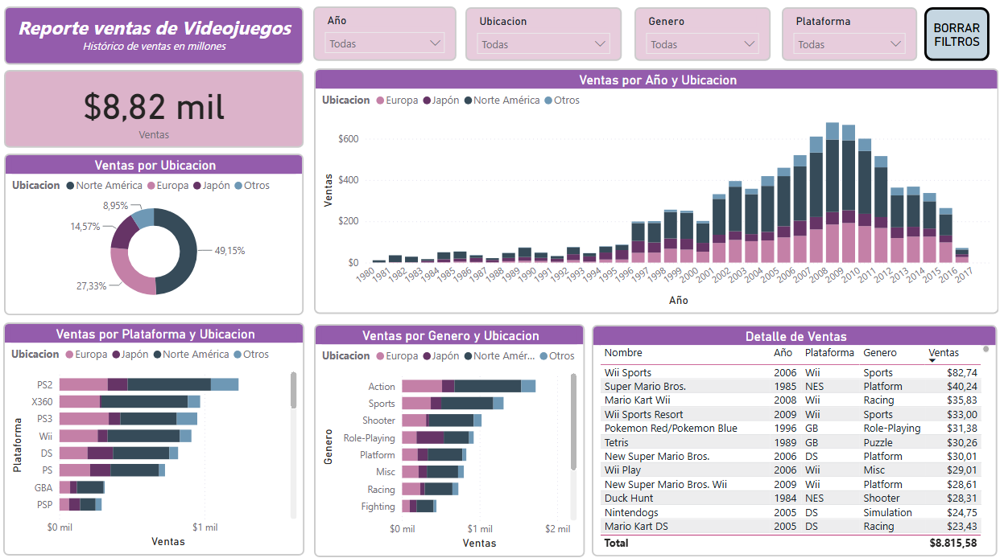
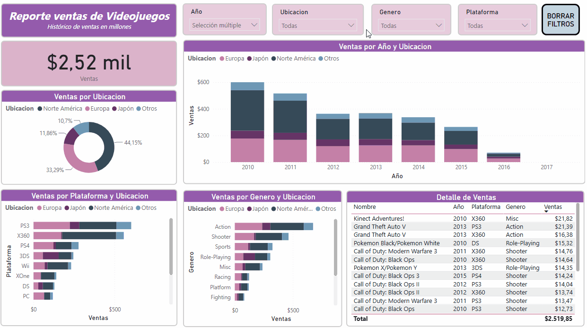

# Análisis de Ventas de Videojuegos — Dashboard en Power BI


## 📌 Descripción del Proyecto
Este proyecto presenta un análisis interactivo y exhaustivo del mercado global de videojuegos entre **1980 y 2017**, procesando más de **16.300 registros** y un volumen acumulado de **8.820 millones de unidades vendidas**.

El objetivo principal es brindar visibilidad integral sobre el rendimiento comercial de la industria, permitiendo segmentar el comportamiento del mercado por **región geográfica, ciclo de vida de consolas, géneros dominantes y publishers líderes**.

---

## 📸 Vista General del Dashboard

> *El reporte integra KPIs, análisis temporal, distribución regional y tablas de detalle con filtros cruzados dinámicos.*



---

## Demostración Interactiva del Dashboard con algunos filtros



---

## 💡 Principales Insights de Negocio

* **Concentración Geográfica:** **Norteamérica (NA)** y **Europa (EU)** representan en conjunto el **76,4%** del mercado mundial (4.333 M y 2.409 M de unidades, respectivamente).
* **Preferencia Regional por Género:** 
  * En **NA** y **EU** los géneros líderes son **Action** (1.722 M totales) y **Sports** (1.309 M totales).
  * En contraste, el mercado de **Japón (JP)** presenta una concentración marcada en **Role-Playing (RPG)**, superando proporcionalmente a otros mercados.
* **Consolas Líderes en Ventas:** La **PlayStation 2 (PS2)** se consolida como la plataforma más vendida de la historia del dataset con **1.233 M de unidades**, seguida por **Xbox 360** (969 M), **PS3** (949 M) y **Wii** (909 M).
* **Liderazgo de Editoriales:** **Nintendo** domina el volumen acumulado de ventas con más de **1.784 millones de copias**, seguido por **Electronic Arts** (1.093 M) y **Activision** (721 M).

---

## 🛠️ Pipeline de Transformación y Modelado (Power Query)

El dataset de origen (`ventas.csv`) fue transformado para garantizar un análisis multidimensional eficiente:

1. **Despivotado de Columnas (Unpivot):** Se normalizaron las métricas regionales (`Ventas NA`, `Ventas EU`, `Ventas JP`, `Ventas Otros`) en dos atributos clave:
   * `Ubicacion`: Dimensión geográfica.
   * `Ventas`: Métrica numérica continua en millones de unidades.
2. **Tipado Estricto de Datos:** Conversión de ventas a formato decimal (`Fixed Decimal / Currency`) y tratamiento de categorías (`Nombre`, `Editorial`, `Genero`, `Plataforma`, `Año`).
3. **Optimización para Visualización:** Creación de jerarquías para filtrado cruzado mediante segmentadores de fecha, género y plataforma.

---

## 📊 Visualizaciones y Componentes del Reporte

| Componente | Tipo de Visual | Función Analítica |
| :--- | :--- | :--- |
| **KPI Total** | Tarjeta (*Card*) | Conteo y volumen de registros analizados. |
| **Evolución Temporal** | Gráfico de Columnas Apiladas | Tendencia histórica de ventas (1980-2017) segmentada por región. |
| **Cuota de Mercado** | Gráfico de Dona | Participación porcentual de ventas por región geográfica. |
| **Rendimiento por Plataforma** | Gráfico de Barras | Comparativa de consolas y hardware por volumen de ventas. |
| **Popularidad de Géneros** | Gráfico de Barras | Distribución de ventas según categorías de juegos. |
| **Detalle de Títulos** | Tabla Matricial (*tableEx*) | Exploración granular por juego, año, consola y género. |
| **Filtros Interactivos** | Segmentadores (*Slicers*) | Filtros por *Año*, *Ubicación*, *Género* y *Plataforma*. |

---

## 📂 Estructura del Repositorio

```text
├── assets/
│   ├── dashboard.png              # Captura en alta resolución del reporte
│   └── interactivo.gif            # Demostración interactiva en GIF (interacción con filtros)
├── data/
│   └── ventas.csv                 # Dataset original procesado
├── pbix/
│   └── Ventas Proyecto 1.pbix     # Archivo del reporte en Power BI Desktop
└── README.md                      # Documentación completa del proyecto
