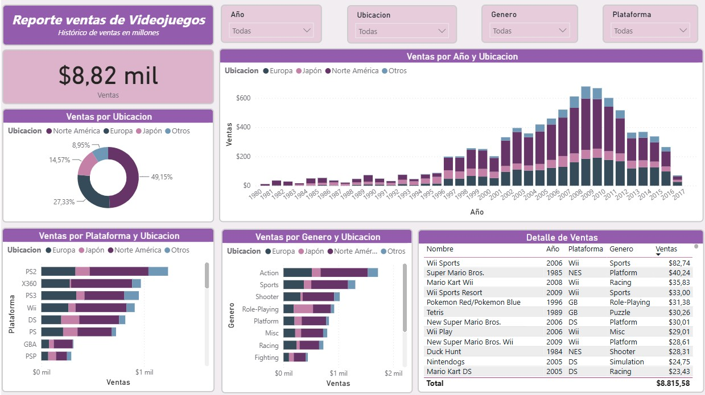

# videogames-sales-powerbi
Dashboard interactivo en Power BI para el análisis histórico de ventas globales de videojuegos.

# Video Games Sales Analytics - Power BI 🎮

¡Hola! Este es un proyecto integral de visualización de datos enfocado en el análisis histórico del mercado global de videojuegos. El objetivo principal fue transformar un conjunto de datos crudos en un reporte visual que permita entender el comportamiento de las ventas según la región, el tiempo, las plataformas y los géneros más populares.

## 📊 Dashboard de Resultados

Aquí se puede observar el reporte estático interactivo desarrollado en Power BI:

## 📌 Características Clave e Insights del Proyecto

* **Segmentación Geográfica:** Análisis detallado de ventas distribuidas en mercados clave (Norteamérica, Europa, Japón y Otros), permitiendo identificar qué regiones dominan según el tipo de contenido.
* **Evolución Temporal:** Gráfico de barras apiladas que muestra la tendencia histórica de ventas por año, haciendo evidente el pico de la industria entre los años 2007 y 2010.
* **Análisis de Plataformas y Géneros:** Clasificación de rendimiento para identificar que las plataformas clásicas (como PS2 y X360) y el género de Acción lideran el volumen histórico de ventas.
* **Tabla de Detalle:** Inclusión de una vista granular con el Top de videojuegos individuales más vendidos a nivel global, facilitando la auditoría de los datos.

## 🛠️ Tecnologías Aplicadas & Competencias

* **Herramienta de Business Intelligence:** Power BI Desktop.
* **Modelado de Datos:** Estructuración de filtros jerárquicos (Año, Ubicación, Género, Plataforma) para una navegación fluida.
* **Diseño de Interfaz (UI):** Aplicación de una paleta cromática armónica y uso eficiente de tarjetas de KPI para el total de ventas ($8,82 mil millones globales).

---
*Este proyecto forma parte de mi portfolio técnico enfocado en el análisis de datos y la business intelligence.*
